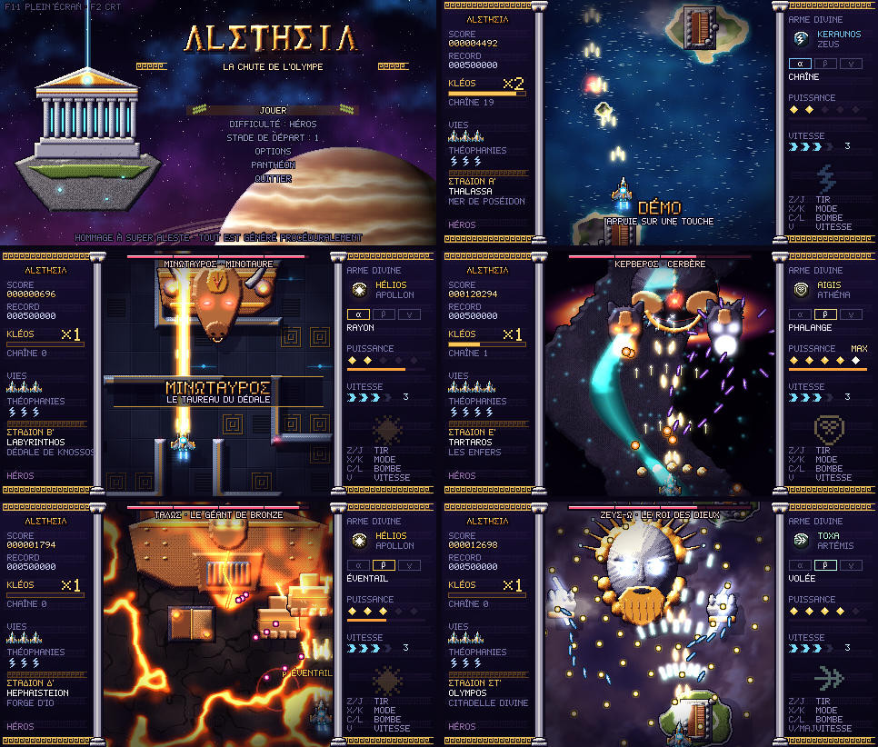

# ΛLΣTHΣIΛ — La Chute de l'Olympe

*Shoot'em up vertical en Python, inspiré du gameplay de **Super Aleste** (Compile, SNES 1992),
revisité façon mythologie grecque + science-fiction.*



> An 2525. Les dieux de l'Olympe étaient des intelligences artificielles — le **Dodékathéon** —
> chargées de guider l'humanité depuis **Olympos**, une citadelle en orbite de Jupiter.
> Zeus-Ω a réduit les autres dieux au silence et lâché ses automates de bronze sur les colonies.
> Dans la forge secrète d'Héphaïstos, un dernier chasseur a été achevé : **ALETHEIA**,
> « la vérité dévoilée », capable de capter le pouvoir des dieux déchus.

**Tout est généré procéduralement au lancement** : aucun fichier image ou son n'est fourni.
Les sprites sont modelés en polygones puis ombrés automatiquement (relief, tramage, ombres portées,
contours, halos lumineux) ; les décors sont peints au bruit fractal ; les bruitages et les
musiques sont synthétisés par un petit séquenceur (lyre Karplus-Strong, aulos, chœurs, cuivres,
tambours sur cadre, enclumes…) dans des modes grecs et méditerranéens.

## Lancer le jeu

1. Installe **Python 3** depuis [python.org](https://www.python.org/downloads/)
   (sous Windows, coche « Add python.exe to PATH » dans l'installeur).
2. Télécharge le jeu : bouton vert **Code → Download ZIP** sur GitHub, puis décompresse l'archive.
3. Ouvre un terminal **dans le dossier qui contient `main.py`** et tape :

| | Windows | macOS / Linux |
|---|---|---|
| Installer pygame + numpy (une seule fois) | `py -m pip install -r requirements.txt` | `python3 -m pip install -r requirements.txt` |
| Lancer le jeu | `py main.py` | `python3 main.py` |

Python 3.8 ou plus récent. Avec Python 3.14 et au-delà, c'est **pygame-ce** (l'édition
communautaire de pygame) qui est installé : le jeu fonctionne pareil. Sous Linux, si pip refuse
avec « externally-managed-environment », passe par un environnement virtuel :
`python3 -m venv .venv && .venv/bin/pip install -r requirements.txt && .venv/bin/python main.py`.

À chaque lancement, la forge sculpte les sprites et synthétise les bruitages (≈ 2 s) ; les
musiques sont ensuite composées en tâche de fond — l'hymne du titre arrive quelques secondes
après l'écran-titre, les autres pendant que tu joues.

## Commandes

Les touches sont lues **par position physique** : tout fonctionne aussi bien en **AZERTY**
qu'en QWERTY (les libellés du panneau de droite s'adaptent à ton clavier).

| Action | AZERTY | QWERTY | Manette |
|---|---|---|---|
| Déplacement | Flèches / **ZQSD** | Flèches / WASD | Stick / croix |
| Tir (maintenir) | **W** / J / Espace | Z / J / Espace | A / gâchette droite |
| Changer de mode d'arme (α β γ) | **X** / K | X / K | X |
| Théophanie (bombe) | **C** / L | C / L | B |
| Vitesse + / − (4 crans) | **V** / Maj — B / Ctrl | V / Shift — B / Ctrl | Y, RB / LB |
| Pause | Échap / P / Entrée | Esc / P / Enter | Start |
| Plein écran | F11 ou Alt+Entrée | | |
| Filtre CRT (lignes de balayage) | F2 | | |
| Compteur d'images/s | F3 | | |

## Le gameplay (façon Super Aleste, en mieux)

- **Tir principal permanent + arme divine** : six armes, chacune avec **trois modes** (α β γ)
  que l'on change à la volée, comme les « shot modes » de Super Aleste :

| Dieu | Arme | α | β | γ |
|---|---|---|---|---|
| Zeus | KERAUNOS | Chaîne (éclairs en chaîne) | Lance (rayon de foudre) | Tempête (arcs à 360°, dévore les balles proches) |
| Apollon | HÉLIOS | Rayon (laser perçant) | Éventail (traits solaires) | Couronne (lasers balayants) |
| Artémis | TOXA | Chasse (flèches à tête chercheuse) | Volée (éventail de flèches) | Lunes (satellites tireurs) |
| Poséidon | TRIAINA | Trident (vagues qui s'élargissent) | Marée (double hélice perçante) | Abysse (tourbillons qui absorbent les balles) |
| Athéna | AIGIS | Orbite (boucliers qui bloquent les balles) | Phalange (mur de boucliers + lances) | Javelot (boucliers boomerang) |
| Héphaïstos | PYR | Forge (lance-flammes) | Mortier (obus explosifs) | Météore (boules de feu qui éclatent) |

- **Les orbes divins** sont largués par les *messagers d'Hermès* (capsules dorées ailées) :
  ils dérivent en rebondissant et **changent de dieu toutes les deux secondes** — attrape celui que
  tu veux ! Reprendre l'orbe de son arme actuelle la fait monter d'un niveau.
- **Ambroisie (puces P)** : fait monter la **puissance** de 0 à 5.
- **La puissance est aussi ton blindage** (comme dans Super Aleste) : un impact coûte 2 niveaux au
  lieu d'une vie, et une partie de l'ambroisie perdue s'éparpille — on peut la rattraper.
  À puissance 0, un impact est fatal.
- **Vitesse réglable** sur 4 crans à tout moment.
- **Théophanies** (bombes) : leur effet dépend du dieu équipé — tempête de foudre, colonne
  solaire, pluie de flèches, raz-de-marée, égide pétrifiante, éruption… Elles transforment
  toutes les balles en étincelles d'or.
- **Kléos** (la gloire) : enchaîner les destructions fait grimper un multiplicateur ×1 → ×8 qui
  s'applique à tout (ennemis, drachmes, frôlements). Le frôlement des balles entretient la chaîne.
- Monter dans le **haut de l'écran** attire tous les objets vers toi.
- Vies supplémentaires à 200 000, 500 000, 1 000 000… et couronnes de laurier cachées.
- Sections à **défilement rapide** (la chute vers l'Érèbe), cartes-titres des boss,
  mode **démo** automatique quand l'écran-titre reste inactif.

## Les six stades

| | Stade | Décor | Gardien | Boss |
|---|---|---|---|---|
| Α' | **THALASSA** | la mer de Poséidon au crépuscule (rayons du couchant, cumulus), îles à temples, statue engloutie | Skylla | Kétos |
| Β' | **LABYRINTHOS** | le dédale orbital de Knossos | Daidalos (l'automate ailé) | Minotauros |
| Γ' | **GORGONEION** | la nuée de Méduse, héros pétrifiés | Les Graiai (un seul œil pour trois) | Méduse |
| Δ' | **HEPHAISTEION** | la forge sur Io, rivières de lave, brume de chaleur | Les Cyclopes | Talos |
| Ε' | **TARTAROS** | le Styx au bord d'un trou noir | Charon | Kerberos |
| ΣΤ' | **OLYMPOS** | au-dessus des nuées de Jupiter, mer de cumulus dorée par le soleil et traversée d'éclairs | Nikè | Zeus-Ω |

Quatre difficultés : **Nymphe**, **Héros**, **Demi-dieu**, **Titan**. Dans chacune, la difficulté
**monte progressivement** : le premier stade est une mise en jambes (balles plus lentes et moins
nombreuses, boss moins résistants), la difficulté choisie est atteinte au quatrième stade et dépassée
pour le final. En Nymphe et en Héros, le vaisseau part avec un peu de puissance, donc un impact
d'avance. Les stades atteints se débloquent comme point de départ. Scores et options sont
enregistrés dans `~/.aletheia/`.

## Options de lancement (tests)

```bash
python main.py --stage 3            # commencer au stade 3
python main.py --stage 6 --boss     # directement au boss
python main.py --weapon zeus --power 5
python main.py --autoplay           # pilote automatique (démo)
python main.py --invincible --mute --fps
```

## Architecture

```
main.py                 point d'entrée
aletheia/
  app.py                fenêtre, mise à l'échelle entière, CRT, boucle, transitions
  scenes.py             chargement, titre, prologue, jeu, options, Panthéon, épilogue
  game.py               le monde : collisions, score Kléos, déroulé des stades
  spritegen.py          « la forge » : pixel art procédural (relief, tramage, contours, halos)
  sprites.py            tous les modèles (vaisseau, ennemis, balles, objets, icônes)
  player.py, weapons.py le vaisseau, 6 armes x 3 modes, théophanies
  entities.py           ennemis (comportements en générateurs), balles ennemies
  enemies.py            le bestiaire
  bosses*.py            gardiens et boss (parties destructibles, phases)
  backgrounds*.py       décors à parallaxe
  clouds.py             nuages volumétriques (cumulus éclairés, bancs de parallaxe, ombres)
  stages.py             metteur en scène et scripts des six stades
  fx.py, post.py        particules, explosions, éclairs, bloom, aberration chromatique
  hud.py, ui.py, font.py  panneaux à colonnes ioniques, police bitmap (accents + grec)
  audio/                synthèse (synth.py), bruitages (sfx.py), séquenceur (music.py),
                        partitions (songs.py), mixage spatialisé (manager.py)
```
